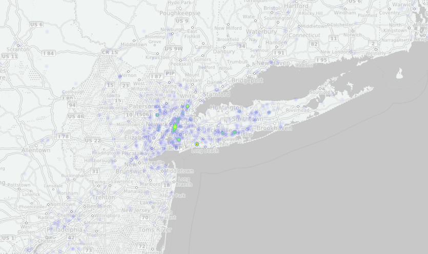

# twitterproject
récolter et représenter les tweets en temps réel. Pour pouvoir lancer les programmes il faut d'abord enregistrer un compte application sur apps.twitter.com pour obtenir les 4 codes d'accès nécéssaires au streaming.
### Dans ce dépôt:

Dans ce dépôt deux programmes qui sont destinés à tourner côté serveur pour récolter les tweets sur un hashtag en temps réel. Le premier script python se contente de les stocker dans une base de données et d'effectuer quelque requêtes de base. le script JS tourne dans un service NodeJS, à l'aide des websockets il "stream" les positions des tweets géolocalisés vers une page html cliente qui les places sur un fonds de carte en utilisant heatmap/leaflet.

### satisfaire les dépendances:
Les deux programmes ont besoins d'un cerain nombre de paquets pour tourner.

- Pour le programme python:

  ```
  sudo pip install tweepy pymongo
  ```
  
  J'ai préparé un petit script pour tout installer il suffit de lancer :
  
  ```
  bash install.sh
  ```
  
- Pour le programme NodeJS:
  
  Il suffit de lancer :

  ````
   sudo npm install
   ````

### Lancer les programmes:

- Lancer le programme Python:
  
  Il faut d'abord renseigner les HashTag que vous voulez suivre. Pour cela éditer le fichier launch.sh et lancer le après en utilisant les deux commandes suivantes:

  ```
  vi launch.sh
  ./launch.sh
  ```
  
  - Lancer le serveur NodeJS:
  
  Il suffit de lancer la commande suivante:
  ```
  node tweet.js
  ```

### Snapshot:



- pour avoir une idée sur la structure d'un tweet capturé (exemple suivi du HashTag SNCF après l'avoir traiter et transformer en format JSON en utilisant le même programme python):

```
{ "_id" : ObjectId("54da4ce57da9336b5c991eec"), "contributors" : null, "truncated" : false, "text" : "La SNCF annonce des projets numériques structurants à très court termes http://t.co/Gx6MA3eNZt #Actu #Tech", "in_reply_to_status_id" : null, "id" : NumberLong("565214768940609536"), "favorite_count" : 0, "source" : "<a href=\"http://dlvr.it\" rel=\"nofollow\">dlvr.it</a>", "retweeted" : false, "coordinates" : null, "timestamp_ms" : "1423592676755", "entities" : { "user_mentions" : [ ], "symbols" : [ ], "trends" : [ ], "hashtags" : [ { "indices" : [ 95, 100 ], "text" : "Actu" }, { "indices" : [ 101, 106 ], "text" : "Tech" } ], "urls" : [ { "url" : "http://t.co/Gx6MA3eNZt", "indices" : [ 72, 94 ], "expanded_url" : "http://dlvr.it/8Twf4q", "display_url" : "dlvr.it/8Twf4q" } ] }, "in_reply_to_screen_name" : null, "id_str" : "565214768940609536", "retweet_count" : 0, "in_reply_to_user_id" : null, "favorited" : false, "user" : { "follow_request_sent" : null, "profile_use_background_image" : false, "default_profile_image" : false, "id" : 162990388, "verified" : false, "profile_image_url_https" : "https://pbs.twimg.com/profile_images/1051826483/MyAvatar_Square_normal.PNG", "profile_sidebar_fill_color" : "F4E5BE", "profile_text_color" : "000000", "followers_count" : 190, "profile_sidebar_border_color" : "FFFFFF", "id_str" : "162990388", "profile_background_color" : "FFFFFF", "listed_count" : 88, "profile_background_image_url_https" : "https://pbs.twimg.com/profile_background_images/119901953/2010-07-05_01-09-10_193.194.132.76.jpg", "utc_offset" : 3600, "statuses_count" : 34443, "description" : "IT Consultant / CEO & Founder Oyonode Solutions", "friends_count" : 157, "location" : "Paris", "profile_link_color" : "86BC4C", "profile_image_url" : "http://pbs.twimg.com/profile_images/1051826483/MyAvatar_Square_normal.PNG", "following" : null, "geo_enabled" : false, "profile_banner_url" : "https://pbs.twimg.com/profile_banners/162990388/1408506225", "profile_background_image_url" : "http://pbs.twimg.com/profile_background_images/119901953/2010-07-05_01-09-10_193.194.132.76.jpg", "name" : "Eric", "lang" : "fr", "profile_background_tile" : false, "favourites_count" : 3, "screen_name" : "EricFitteDuval", "notifications" : null, "url" : "http://fr.linkedin.com/in/ericfitteduval", "created_at" : "Mon Jul 05 07:22:18 +0000 2010", "contributors_enabled" : false, "time_zone" : "Paris", "protected" : false, "default_profile" : false, "is_translator" : false }, "geo" : null, "in_reply_to_user_id_str" : null, "possibly_sensitive" : false, "lang" : "fr", "created_at" : "Tue Feb 10 18:24:36 +0000 2015", "filter_level" : "low", "in_reply_to_status_id_str" : null, "place" : null }
```

### Perspectives:

- Next step ==> Effectuer l'analyse de sentiment sur les tweets capturés.
